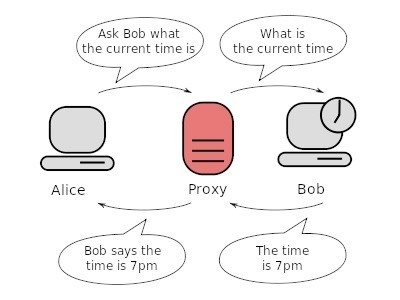

# Forward proxy server

## Introduction
In computer networks, A proxy server is a server ( A computer system or
an application ) that acts as an intermediary for requests from clients
seeking resources from other servers. A client connects to the proxy
server, requesting some service, such as a file, connection, web page,
or other resource available from a different server and the proxy server
evaluates the request as a way to simplify and control its complexity.

Proxies were invented to add structure and encapsulation to distributed
systems. Today, most proxies are web proxies, facilitating access to
content on the World Wide Web and providing anonymity.

### illustration
<p align ="left">

</p>
What Bob thinks is the server ( i.e the proxy ) asked for the current time, But what Bob didn't know was, Alice asked for the current time but through the proxy server. The proxy server returns the current time to Alice. So we can basically say, Server Bob has been tricked. The proxy server acts as a man in the middle serving two people without revealing their identities to each other, Each person sees only the proxy but not the other end.

## Run
```
python server.py
```
